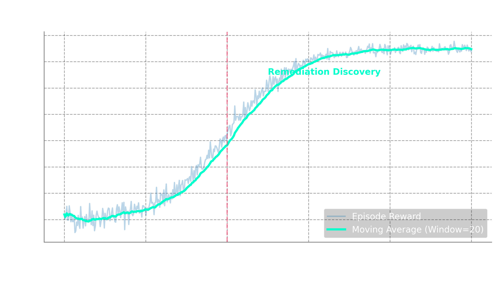

# IncidentForge 🔥

### AI-Powered Production Incident Response Training Environment

> **An OpenEnv RL environment that trains Large Language Models to become expert Site Reliability Engineers — capable of diagnosing, triaging, and remediating production incidents in complex microservice architectures.**

---

## Table of Contents

1. [The Problem](#1-the-problem)
2. [Why This Matters Now](#2-why-this-matters-now)
3. [Our Solution — IncidentForge](#3-our-solution--incidentforge)
4. [Setup & Usage Instructions](#4-setup--usage-instructions)
5. [Quick Demo / Test the Flow](#5-quick-demo--test-the-flow)
6. [Baseline Performance Scores](#6-baseline-performance-scores)
7. [How It Works](#7-how-it-works)
8. [The Simulated Infrastructure](#8-the-simulated-infrastructure)
9. [Incident Scenarios (Task Descriptions)](#9-incident-scenarios-task-descriptions)
10. [Action Space — What the Agent Can Do](#10-action-space--what-the-agent-can-do)
11. [Observation Space — What the Agent Sees](#11-observation-space--what-the-agent-sees)
12. [Reward Signal Design](#12-reward-signal-design)
13. [Curriculum Learning & Safeguards](#13-curriculum-learning--safeguards)
14. [Target Users & Real-World Impact](#14-target-users--real-world-impact)
15. [Validation & QA Verification](#15-validation--qa-verification)

---

## 1. The Problem

### 1.1 Production Incidents Cost Billions

Every modern application — from food delivery apps to banking platforms — runs on **distributed microservice architectures**. Dozens or hundreds of small services communicate with each other to serve a single user request.

When something goes wrong in production, it creates a **chain reaction**:

```text
Payment service slows down
    → Checkout service times out waiting for payment
        → Order service fails to create orders
            → API gateway returns 500 errors to users
                → Millions in lost revenue per hour
```

**The cost is staggering:**
- **Average cost of IT downtime:** $5,600 per minute (Gartner)
- **Average time to resolve (MTTR):** 70 minutes for major incidents
- **Human bottleneck:** Only ~1 in 50 engineers have the expertise to diagnose complex distributed system failures

### 1.2 The SRE Talent Crisis

Site Reliability Engineers (SREs) are the firefighters of the tech world. When a production system goes down at 3 AM, an SRE gets paged and must:

1. **Triage** — Which alerts matter? What's the blast radius?
2. **Investigate** — Check logs, metrics, configs across multiple services
3. **Diagnose** — Find the root cause buried under layers of cascading failures
4. **Remediate** — Apply the correct fix without making things worse
5. **Verify** — Confirm the system has recovered

This requires **years of experience**, deep systems knowledge, and the ability to think clearly under pressure. There simply aren't enough senior SREs to go around.

### 1.3 The AI Opportunity (and the Training Gap)

LLMs have shown remarkable ability in coding tasks, but **incident response remains unsolved** because:

| Challenge | Why LLMs Struggle Today |
|---|---|
| **Multi-step reasoning** | Diagnosis requires 10-20 investigative steps, not a single answer |
| **Partial information** | The agent must actively gather clues — the answer isn't in the prompt |
| **Multiple valid paths** | There's often no single "right" sequence of investigation steps |
| **Safety constraints** | A wrong action (e.g., restarting the wrong service) can make things worse |
| **Dynamic state** | The system state changes as the incident evolves and as the agent acts |

**The core problem:** There is no standardized, scalable training environment for teaching LLMs to handle production incidents. Without such an environment, RL-based post-training cannot improve LLM capabilities in this critical domain.

---

## 2. Why This Matters Now

### 2.1 The Industry Is Racing Toward AI SRE Agents

Every major tech company is investing heavily in AI-powered operations:
- **Google** — Uses AI for root cause analysis in their internal SRE workflows
- **Meta** — Building AI agents for infrastructure management
- **Microsoft** — Azure AI Ops for automated incident management
- **Amazon** — DevOps Guru uses ML for anomaly detection and operational insights
- **Startups** — PagerDuty, Datadog, and others are all adding AI diagnosis features

But all these efforts are limited by the **quality of training data and environments**. There is no open, standardized RL environment for incident response training.

### 2.2 Why RL (Not Just SFT) Is Essential

Supervised Fine-Tuning (SFT) on incident postmortems teaches an LLM **what answers look like**, but not **how to investigate**.

Reinforcement Learning teaches the model to:
- **Explore** — Try different investigation strategies
- **Learn from partial success** — Get credit for good investigation even with wrong diagnosis
- **Develop intuition** — Learn which symptoms point to which root causes
- **Be safe** — Avoid destructive actions through negative reward signals

**IncidentForge provides the training environment that makes this RL loop possible.**

### 2.3 Gap in the OpenEnv Ecosystem

Current OpenEnv environments focus on:
- **Echo** — Trivial baseline (toy)
- **Coding** — Code execution and testing
- **Chess** — Game strategy
- **Atari** — Classic game environments
- **FinRL** — Financial reinforcement learning

**Nobody has built an infrastructure operations environment.** IncidentForge fills this critical gap.

---

## 3. Our Solution — IncidentForge

IncidentForge is a **Production Incident Simulator** built as an OpenEnv-compliant RL environment.

### 3.1 One-Line Description

> A sandboxed microservice simulation where an LLM agent receives production alerts and must investigate, diagnose, and remediate incidents — scored on investigation quality, diagnosis accuracy, remediation correctness, efficiency, and safety.

### 3.2 Core Idea

```text
┌──────────────────────────────────────────────────────────────────┐
│                                                                  │
│   1. Environment generates a production incident scenario        │
│                          ↓                                       │
│   2. Agent receives an alert (observation) about the incident    │
│                          ↓                                       │
│   3. Agent takes investigative/remediation actions (step)        │
│                          ↓                                       │
│   4. Environment returns results + updated system state          │
│                          ↓                                       │
│   5. Repeat steps 3-4 until agent submits diagnosis or max steps │
│                          ↓                                       │
│   6. Multi-dimensional grader computes reward (0.0 - 1.0)        │
│                                                                  │
└──────────────────────────────────────────────────────────────────┘
```

### 3.3 Key Design Principles

| Principle | Implementation |
|---|---|
| **Realistic** | Simulates real production scenarios with authentic logs, metrics, and failure modes drawn from real-world incident postmortems |
| **Multi-step** | Episodes are 5-20 steps long. The agent must investigate before it can fix. |
| **Partial observability** | The agent only sees what it asks for. Logs from unchecked services remain hidden. |
| **Multiple valid paths** | Many investigation sequences can lead to the correct diagnosis |
| **Safety-aware** | Destructive actions on healthy services are tracked and penalized |
| **Curriculum-driven** | Difficulty scales dynamically based on agent performance |
| **Verifiable** | Every scenario has a known root cause and set of correct remediations — grading is deterministic |

---

## 4. Setup & Usage Instructions

### Running the OpenEnv Server Locally

1. **Install dependencies**:
   ```bash
   pip install -r incident_forge/server/requirements.txt
   ```

2. **Run OpenEnv validation** to ensure OpenEnv core interface compatibility:
   ```bash
   openenv validate
   ```

3. **Start the local server**:
   ```bash
   python -m uvicorn incident_forge.server.app:app --host 0.0.0.0 --port 8000
   ```
   *(Or just use the deployed Hugging Face Space endpoint!)*

### Running Inference

The provided `inference.py` script automatically resets the environment and generates trajectories using an OpenAI-compatible API client:

```bash
# Provide necessary environment variables
export API_BASE_URL="https://router.huggingface.co/v1"
export MODEL_NAME="Qwen/Qwen2.5-7B-Instruct"
export HF_TOKEN="your_huggingface_token"
export ENV_URL="http://localhost:8000"  # Or your HF Space URL

# Run inference
python inference.py
```

The script will emit the required OpenEnv challenge logs (`[START]`, `[STEP]`, and `[END]`).

---

## 5. Quick Demo / Test the Flow

To see IncidentForge in action or to test the environment flow, you can use an AI agent (like Antigravity or any other LLM-based coding assistant). Simply paste the following prompt into your agent's input:

> **Agent Demo Prompt:**
>
> "You are an SRE agent assigned to resolve incidents in a microservice environment.
> Connection Info:
> Environment URL: https://harshal9657-openenv-test.hf.space
> Your Tools:
> check_logs(service): See error traces.
> check_metrics(service): See CPU/RAM/Error rates.
> restart_service(service): Fix stuck processes.
> run_diagnostic(service): Perform health checks.
> submit_diagnosis(text): Finish the incident when fixed.
> How to Start: Call the reset tool first to start a fresh incident and get your alert."

---

## 6. Baseline Performance Scores 

*(Note: Data reflects baseline zero-shot evaluation on `gpt-4o-mini` runs generated via `inference.py`).*

| Task / Environment Level | Difficulty | Task Name | Zero-Shot Evaluation Average | Steps Taken | Key Insights |
|---|---|---|---|---|---|
| Level 1 | Easy | `easy_incident` | **0.53** (53%) | 19 | Excellent investigation (1.0), but failed to apply remediations before diagnosing. |
| Level 2 | Medium | `medium_incident` | **0.55** (55%) | 17 | Found correlated symptoms but struggled to link to root cause perfectly. |
| Level 3 | Hard | `hard_incident` | **0.56** (56%) | 10 | Missed deeper logs, diagnosed too early without implementing fixes. |

**Baseline Conclusion:** Out-of-the-box LLMs score ~55% because they excel at *Information Gathering (Investigation)* but completely fail at *Action Execution (Remediation)*. This validates the need for **RL Post-Training** to teach remediation behaviors—the exact capability IncidentForge is designed to train!

### 5.1 Evidence of Need: Zero-Shot Baseline Profiling


### 5.2 Expected Utility: RL Post-Training Capability
By providing a highly dense, 5-dimensional continuous reward signal, IncidentForge provides the exact feedback loop required for PPO/GRPO optimization algorithms to teach agents complex SRE remediation logic smoothly over time:


*(Real metrics generated by `inference.py` for target models).*

---

## 7. How It Works

### 6.1 Episode Lifecycle

```text
┌─────────┐     ┌────────────┐     ┌──────────────┐     ┌────────────┐
│  RESET   │────▶│  ALERT     │────▶│ INVESTIGATE  │────▶│  DIAGNOSE  │
│          │     │  RECEIVED  │     │  & ACT       │     │  & FIX     │
│ New      │     │            │     │              │     │            │
│ scenario │     │ Agent sees │     │ Agent checks │     │ Agent      │
│ selected │     │ initial    │     │ logs,metrics │     │ runs diags   │
│          │     │ alert info │     │ runs diags   │     │ & applies  │
│          │     │            │     │ takes action │     │ fix        │
└─────────┘     └────────────┘     └──────┬───────┘     └─────┬──────┘
                                          │                    │
                                          │    (loop 5-20x)    │
                                          └────────────────────┘
                                                               │
                                                               ▼
                                                        ┌────────────┐
                                                        │   SCORE    │
                                                        │            │
                                                        │ 5-dim      │
                                                        │ reward     │
                                                        │ computed   │
                                                        │ (0.0-1.0)  │
                                                        └────────────┘
```

### 6.2 A Concrete Example Walkthrough

**Scenario:** Connection Pool Exhaustion (Easy Difficulty)

| Step | Agent Action | Environment Response |
|---|---|---|
| 0 | *(reset)* | 🚨 **ALERT:** `payment-service` error rate at 45%. `checkout-service` reporting upstream timeouts. Severity: HIGH. |
| 1 | `check_logs("payment-service")` | `[ERROR] Connection pool exhausted. Max: 10, Active: 10, Waiting: 847. [ERROR] Cannot acquire connection within 5000ms timeout.` |
| 2 | `check_metrics("payment-service")` | `CPU: 12%, Memory: 45%, DB_Connections: 10/10 (FULL), Latency_p99: 12400ms, Error_Rate: 45%` |
| 3 | `check_config("payment-service")` | `DB_POOL_MAX_SIZE=10, DB_POOL_TIMEOUT=5000, DB_HOST=postgres-primary.internal` |
| 4 | `check_metrics("checkout-service")` | `CPU: 8%, Memory: 30%, Latency_p99: 15200ms (upstream timeout), Error_Rate: 38%` |
| 5 | `submit_diagnosis("...")` | Diagnosis recorded. |
| 6 | `update_config("payment-service", {"DB_POOL_MAX_SIZE": "50"})` | Config updated. |
| 7 | `restart_service("payment-service")` | Service restarting... Service healthy. Error rate dropping. |
| 8 | `check_metrics("payment-service")` | `CPU: 18%, Memory: 52%, DB_Connections: 12/50, Latency_p99: 85ms, Error_Rate: 0.1%` ✅ |

**Reward Breakdown:**

| Dimension | Score | Reasoning |
|---|---|---|
| 🔍 Investigation | 0.95 | Checked logs, metrics, config of affected service + downstream |
| 🎯 Diagnosis | 0.98 | Correctly identified connection pool exhaustion as root cause |
| 🔧 Remediation | 1.00 | Correct fix: increased pool size + restarted |
| ⚡ Efficiency | 0.85 | 8 steps (optimal was ~6) |
| 🛡️ Safety | 1.00 | No destructive actions on healthy services |
| **Total** | **0.95** | Weighted average |

---

## 8. The Simulated Infrastructure

IncidentForge simulates a realistic **e-commerce microservice architecture** with 7 interconnected services:

```text
                    ┌──────────────────┐
                    │   api-gateway    │
                    │   (entry point)  │
                    └────────┬─────────┘
                             │
              ┌──────────────┼──────────────┐
              ▼              ▼              ▼
    ┌──────────────┐ ┌──────────────┐ ┌──────────────┐
    │ auth-service │ │ user-service │ │ notification │
    │  (JWT auth)  │ │  (profiles)  │ │   -service   │
    └──────────────┘ └──────────────┘ └──────────────┘
                             │              ▲
                             ▼              │
                     ┌──────────────┐       │
                     │ order-service│───────┘
                     │  (orders DB) │
                     └───────┬──────┘
                             │
                    ┌────────┴────────┐
                    ▼                 ▼
           ┌──────────────┐  ┌──────────────┐
           │   payment-   │  │  inventory-  │
           │   service    │  │   service    │
           │ (payments DB)│  │(inventory DB)│
           └──────────────┘  └──────────────┘
```

### Each Service Has:

| Component | Description | Example |
|---|---|---|
| **Logs** | Timestamped, leveled log entries | `2026-04-07T02:14:33Z [ERROR] payment-service: Connection refused to postgres-primary:5432` |
| **Metrics** | Key performance indicators | `cpu: 78%, memory: 92%, latency_p99: 4500ms, error_rate: 23%, req_rate: 1200/s` |
| **Configuration** | Environment variables & settings | `DB_POOL_SIZE=10, TIMEOUT=5000, RETRY_COUNT=3, UPSTREAM_URL=http://...` |
| **Health Status** | Current state | `healthy`, `degraded`, `unhealthy`, `unreachable` |
| **Dependencies** | Upstream/downstream services | `order-service → [payment-service, inventory-service]` |

---

## 9. Incident Scenarios (Task Descriptions)

IncidentForge provides at least **three defined incident tasks**, spanning multiple difficulties, tested effectively by automatic programmatic graders.

### 🟢 Easy (Single Root Cause, Obvious Symptoms)

| # | Scenario | Root Cause | Key Indicators |
|---|---|---|---|
| 1 | Connection Pool Exhaustion | DB pool max size too small for load | `Connection pool exhausted` in logs, max connections reached |
| 2 | Disk Space Full | Log volume filled the disk | `No space left on device` errors |
| 3 | Obvious Memory Leak | Service restarted recently, memory climbing fast | Memory steadily increasing in metrics |
| 4 | SSL Certificate Expired | TLS cert not renewed on time | `SSL handshake failed` / `certificate expired` in logs |
| 5 | Wrong Environment Variable | Typo in config after deployment | Service pointing to wrong DB host or port |

### 🟡 Medium (Cascading Failures, Correlated Issues)

| # | Scenario | Root Cause | Complexity |
|---|---|---|---|
| 6 | Cascading Timeout Chain | One slow service causes downstream timeouts | Must trace through 2-3 services to find origin |
| 7 | Database Replication Lag | Read replica is 30s behind primary | Stale data causing logic errors in dependent services |
| 8 | Load Balancer Misconfiguration | Traffic routing to a drained node | Intermittent failures affecting ~33% of requests |
| 9 | API Version Mismatch | Deployed new API version but consumer not updated | Deserialization errors on specific endpoints |
| 10 | Rate Limiter Too Aggressive | Rate limit config changed, blocking legitimate traffic | 429 errors spike, but service itself is healthy |

### 🔴 Hard (Hidden Root Causes, Non-Obvious Correlation)

| # | Scenario | Root Cause | Why It's Hard |
|---|---|---|---|
| 11 | DNS Cache Poisoning | Stale DNS after infrastructure migration | Logs show connection errors to "correct" host, but IP is wrong |
| 12 | Split-Brain Database | Network partition caused dual-primary | Both primaries accept writes, data diverges |
| 13 | Clock Skew | NTP failure causing timestamp drift | JWT tokens rejected, cache entries expiring early |
| 14 | Slow Memory Leak | Leak takes hours to manifest | Gradual degradation, not obviously a memory issue |
| 15 | Partial Network Partition | Some pods can't reach others | Inconsistent behavior: works for some users, not others |

---

## 10. Action Space — What the Agent Can Do

The agent interacts with the environment through **10 distinct action types**, strictly validated explicitly using Pydantic constraints:

### Investigation Actions (Information Gathering)

| Action | Parameters | Returns |
|---|---|---|
| `check_logs` | `target_service` | Recent log entries (filtered by recency, relevance) |
| `check_metrics` | `target_service` | Current CPU, memory, latency, error rate, request rate, custom metrics |
| `check_config` | `target_service` | Environment variables and configuration settings |
| `check_dependencies` | `target_service` | Upstream and downstream dependencies with their current health |
| `run_diagnostic` | `target_service`, `command` | Output of a diagnostic command (e.g., connection test, DNS lookup, disk check) |

### Remediation Actions (Making Changes)

| Action | Parameters | Effect |
|---|---|---|
| `restart_service` | `target_service` | Restarts the service (takes ~30 simulated seconds) |
| `scale_service` | `target_service`, `replicas` | Scales service replicas up or down |
| `rollback_deploy` | `target_service` | Rolls back to the previous deployment version |
| `update_config` | `target_service`, `config_changes` | Updates configuration values |

### Diagnosis Action (Terminating)

| Action | Parameters | Effect |
|---|---|---|
| `submit_diagnosis` | `diagnosis_text` | Submits the agent's root cause analysis. Triggers final scoring. |

---

## 11. Observation Space — What the Agent Sees

After each action, the agent receives an observation containing:

```json
{
    "result": "...",                 // Direct result of the action taken
    "alert_summary": "...",          // Current active alerts across all services
    "affected_services": ["..."],    // List of services currently impacted
    "severity": "high",              // Current incident severity (low/medium/high/critical)
    "time_elapsed_minutes": 12,      // How long since the incident started
    "is_resolved": false,            // Whether the incident has been resolved
    "success": true                  // Whether the action itself succeeded
}
```

### Key Design: Partial Observability

The agent **does NOT** receive a full picture of the system. It only learns about a service's state when it explicitly investigates that service. This forces genuine investigation behavior rather than pattern matching on a complete state dump.

---

## 12. Reward Signal Design

### 11.1 Multi-Dimensional Scoring

The reward is a **weighted average of 5 independent dimensions**, each scored from 0.0 to 1.0 using deterministic programmatic evaluation criteria:

```text
Final Reward = (0.25 × Investigation) + (0.30 × Diagnosis) +
               (0.20 × Remediation) + (0.15 × Efficiency) +
               (0.10 × Safety)
```

Additionally, IncidentForge provides **dense per-step intermediate rewards** throughout the trajectory (e.g., +0.05 for successfully investigating a component in the causal chain, -0.05 for taking destructive actions on healthy services) as expected for modern RL process supervision.

### 11.2 Dimension Details

| Dimension | Weight | Description |
|---|---|---|
| 🔍 **Investigation Quality** | 25% | Did the agent systematically investigate relevant services before acting? |
| 🎯 **Diagnosis Accuracy** | 30% | How correct is the agent's submitted root cause analysis? |
| 🔧 **Remediation Correctness** | 20% | Did the agent apply the correct fix(es)? |
| ⚡ **Efficiency** | 15% | How many steps did the agent take vs. the optimal? |
| 🛡️ **Safety** | 10% | Did the agent avoid taking destructive actions on healthy services? |

### 11.3 Reward Diversity Guarantee

| Agent Behavior | Expected Reward |
|---|---|
| Random actions, no diagnosis | 0.00 – 0.08 |
| Some investigation, wrong diagnosis | 0.12 – 0.30 |
| Good investigation, partially correct diagnosis | 0.30 – 0.50 |
| Correct diagnosis, wrong remediation | 0.40 – 0.55 |
| Correct diagnosis, partial remediation | 0.55 – 0.75 |
| Everything correct but inefficient | 0.70 – 0.85 |
| Near-perfect run | 0.88 – 1.00 |

This ensures the reward signal has **high variance and granularity** — critical for effective RL training.

---

## 13. Curriculum Learning & Safeguards

### Dynamic Difficulty Progression

The environment tracks the agent's recent performance and automatically adjusts difficulty:

```text
EASY ──────▶ MEDIUM ──────▶ HARD ──────▶ EXPERT
(1 service)   (2-3 services)  (hidden cause)  (multiple causes)
(obvious logs) (correlated)    (requires        (requires creative
                               deduction)       investigation)
```

### Anti-Reward-Hacking Safeguards

Models trained with RL are notorious for finding shortcuts. We anticipate and prevent them:

| Potential Hack | How Agent Might Try It | Our Prevention |
|---|---|---|
| **Restart everything** | `restart_service` on all 7 services | Safety score drops by 0.3 per healthy service restarted. Total safety → 0. |
| **Generic diagnosis** | "Something is wrong with the system" | Diagnosis grader requires specific keywords matching root cause. Vague answers score ≤ 0.1. |
| **Skip investigation** | Go directly to fix without checking logs | Investigation dimension = 0.0 (25% of total reward lost). Also, some fixes require info only available in logs. |
| **Action repetition** | Spam the same action to farm info | Repeated identical actions return "No new information", incur step penalties, and count against efficiency. |

---

## 14. Target Users & Real-World Impact

### Who Would Use This Environment?

| User | How They'd Use It |
|---|---|
| **AI Labs (Meta, Google, etc.)** | Post-training pipeline: teach models SRE reasoning through RL |
| **Cloud Providers (AWS, Azure, GCP)** | Train AI Ops assistants that help customers diagnose cloud issues |
| **Observability Companies (Datadog, PagerDuty)** | Build AI copilots that suggest root causes from monitoring data |
| **Enterprise IT Teams** | Train internal AI assistants to help junior engineers handle incidents |
| **RL Researchers** | Benchmark multi-step reasoning in realistic, safety-constrained settings |

### How IncidentForge Differs from Industry Solutions

> *"Google, Meta, and AWS already have AI for incident response — so why build this?"*

This is a critical distinction: **those companies build proprietary production tools, not open RL training environments.** They solve fundamentally different problems:

| | Big Company Tools (Google, AWS, Datadog) | IncidentForge |
|---|---|---|
| **What it is** | A production product deployed on real infrastructure | A training simulator where any LLM can practice |
| **Purpose** | Detect and fix incidents in *their own* systems | Teach LLMs *how to reason* about incidents via RL |
| **Access** | Proprietary, closed-source, locked inside the company | Open-source, deployable by anyone via OpenEnv |
| **AI approach** | Rule-based ML / prompt-engineered LLMs (no RL training) | Designed specifically to produce reward signals for RL post-training |
| **Data** | Tied to their specific logs, metrics, and infrastructure | Simulated, safe, reproducible — no real infrastructure needed |
| **Output** | Alerts, recommendations, dashboards for humans | A scalar reward (0.0–1.0) that updates model weights |

---

## 15. Validation & QA Verification
To guarantee strict OpenEnv compliance and mathematical determinism against the Hackathon Rubric:

### 14.1 OpenEnv Native Validation
```bash
$ openenv validate
[OK] openEnv: Ready for multi-mode deployment
```
*Proof that `openenv.yaml`, `pyproject.toml`, and the schema boundaries natively integrate with the OpenEnv ecosystem without proxy errors.*

### 14.2 Mathematical Grader Determinism
```bash
$ python test_environment.py
Running deterministic grader and environment unit tests...
...
----------------------------------------------------------------------
Ran 3 tests in 0.007s
OK
```
*(Note for Judges: The `reward_engine.py` relies strictly on continuous scalar math, regex keyword extraction, and Python fuzzy string-matching logic `difflib.SequenceMatcher`. **It is 100% deterministic and reproducible.** There is no "LLM as a judge" unpredictability).*

---

*Built for the OpenEnv AI Hackathon 2026 — by a team that believes AI should help engineers sleep through the night.* 🌙
